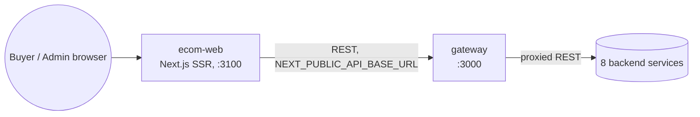
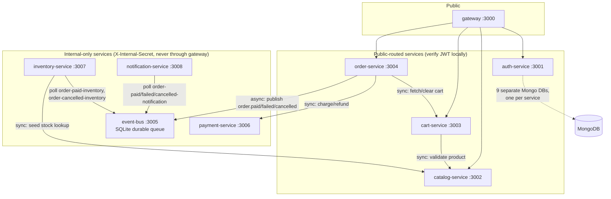
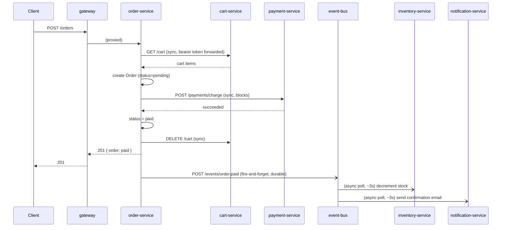
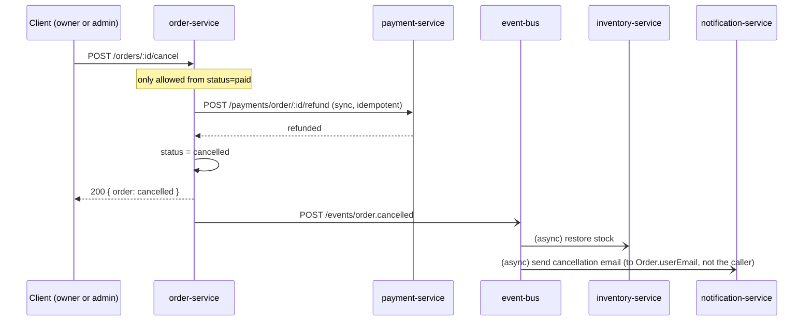

# High-Level Design — E-Commerce Marketplace

Companion to [REQUIREMENTS.md](./REQUIREMENTS.md) (what) and [LLD.md](./LLD.md) (how, in detail).
This document is the "why this shape" view: architecture style, service boundaries, primary flows,
and which requirements are actually met today vs still open.

## 1. Purpose & scope

A single-store (phase 1) e-commerce marketplace: buyers browse/search/cart/checkout/pay, admins manage
catalog and orders. Multi-vendor (seller onboarding, order splitting, commission) is an explicit phase-2
scope cut — see REQUIREMENTS.md's scope note. Everything in this document describes what's actually
built and running, not an aspirational target; gaps are called out explicitly in §9.

## 2. Architectural style

**Microservices, one service per bounded context, each with its own database.** Chosen over a
monolith because the NFRs explicitly ask for independent scaling per service (NFR11) and stateless,
horizontally-scalable instances (NFR13) — both cheap to get from day one with service boundaries,
expensive to retrofit later.

- **Synchronous (REST over HTTP)** for anything the caller needs an immediate answer to before it can
  respond to the end user: fetching a cart, charging a card, refunding a card. If the downstream call
  fails, the request fails — there's no path to "checkout succeeded but we don't know if payment
  happened."
- **Asynchronous (durable queue)** for everything that's a side effect of an already-decided outcome:
  decrementing stock, sending an email. These must never be able to block or fail the request that
  triggered them, and must survive a consumer being temporarily down — hence a real durable queue
  (event-bus) rather than a fire-and-forget webhook.

This sync/async split is the single most important architectural decision in the system — see §6 for
where the line is drawn on each flow.

## 3. System context

The frontend never talks to a backend service directly — everything goes through the gateway, which is
the only public-facing entry point besides the frontend's own :3100.

## 4. Service topology

Every arrow that crosses a service boundary is either a REST call with the caller's own bearer token
forwarded (never a shared session) or an internal-secret-gated call to event-bus — there is no
service-to-service trust based on network position alone. See LLD §1 for the auth model in detail.

## 5. Technology stack

| Layer | Choice | Why |
|---|---|---|
| Runtime | Node.js + Express | Consistent stack across all 9 services, minimal per-service ceremony |
| Database | MongoDB, one DB per service | Matches the per-service data ownership microservices require; Atlas free/shared tier acceptable at "small scale" (NFR19) |
| Gateway | Express + `http-proxy-middleware` | Thin routing/CORS/rate-limit layer; deliberately does **not** own auth (see §6) |
| Async messaging | Custom `event-bus` (SQLite-backed pull queue) | SQS-shaped API and delivery semantics, no AWS dependency for local dev — swappable for real SQS/SNS at deploy time without touching consumer code |
| Auth | JWT (access 15m + refresh 7d httpOnly cookie), bcrypt | Stateless verification (NFR13), no per-request auth-service round trip |
| Frontend | Next.js 16 App Router, TypeScript, Tailwind | SSR product pages for SEO/perf, client components where interactivity is needed |
| Observability | Structured JSON logs + `AsyncLocalStorage`-based correlation IDs | See §8 |

## 6. Primary flows

### 6.1 Checkout (success path)

The client gets its response the moment payment clears — inventory and email are never on that
critical path. If either worker is down, the message just waits in its queue; nothing is lost.

### 6.2 Checkout (decline path)
Same shape, but `payment-service` returns `failed` at step 4: order status becomes `failed`, the cart
is **left untouched** (so the user can retry without re-adding items), and `order.failed` is published
instead — routed only to `notification-service` (a declined payment never reserves/decrements stock).

### 6.3 Cancellation

Deliberately mirrors the checkout shape: refund is synchronous (the actor needs to know immediately
whether it worked) while stock restore and the email are async side effects. `Order.userEmail` is
denormalized at checkout time specifically so an admin cancelling on a customer's behalf still emails
the customer, not themselves.

## 7. Cross-cutting concerns

**Auth model** — `auth-service` is the only issuer of JWTs; every other service verifies access tokens
locally against a shared secret, with no network round-trip per request (this is what makes NFR13's
"any instance handles any request" cheap). Service-to-service calls that act "as the user" forward the
caller's own bearer token rather than using a shared service identity. Internal-only services
(event-bus, payment, inventory, notification) use a separate shared `X-Internal-Secret` instead — they
never see an end-user token because they're never reached through the gateway.

**Error handling** — every service uses the same `AppError` shape (`statusCode`, `code`,
`message`), thrown from services/controllers and caught by a uniform `errorHandler` middleware, so
every API in the system returns the same `{ error: { code, message } }` JSON shape regardless of which
service produced it.

**Idempotency** — both `payment-service` endpoints that have real-world consequences (`charge`,
`refund`) are idempotent keyed on `orderId`: a retried call returns the first result rather than
double-charging or double-refunding. This matters because `order-service`'s calls to them are
synchronous over an unreliable network — a client-side timeout doesn't imply the server-side call
didn't succeed.

## 8. Observability

Every service (gateway included) stamps or forwards an `X-Correlation-Id` as the very first thing that
happens to a request, and an `AsyncLocalStorage` context makes every subsequent log line in that
request's lifetime — and, critically, in the async worker that eventually processes the resulting queue
message — carry the same id automatically. Full mechanism in LLD §3. This is what makes "trace one
order across 9 services, including the async legs" (NFR17) actually tractable instead of a grep-and-pray
exercise.

Every service also exposes `GET /metrics` (Prometheus text format via `prom-client`): request count,
latency histogram, and error rate per `{method, route, status_code}` (NFR16), plus free process-level
metrics (CPU, memory, event-loop lag). Route labels normalize id-shaped path segments to `:id` so
per-entity cardinality doesn't explode. Not gateway-proxied — scraped directly per service, same as
`/health`. Full design in LLD §3.2, including a real route-labeling bug found and fixed while building
it (a successful response and an error response to the *same* endpoint were briefly recording under two
different labels).

**Not yet built**: nothing ships or aggregates these structured logs anywhere (no ELK/Loki/CloudWatch) —
see §9, §11.

## 9. Requirements coverage

| Requirement | Status | Notes |
|---|---|---|
| FR1–FR8 (browse/search/cart/checkout/pay/auth/order history) | ✅ Met | Verified end-to-end incl. admin UI; FR2's rating filter is now backed by a real reviews module (catalog-service) |
| FR9 (guest cart) | ❌ Not built | Explicitly phase-2 in REQUIREMENTS.md |
| FR10, FR11 (admin CRUD, order mgmt, refund) | ✅ Met | Refund/cancel added and verified this session |
| FR12–FR14 (multi-vendor) | ❌ Not built | Explicitly deferred, biggest remaining scope item |
| FR15 (inventory decrement + restore) | ✅ Met | Restore added alongside cancellation |
| FR16, FR17 (notifications, event flow) | ✅ Met | Now covers paid/failed/cancelled |
| NFR1–NFR5 (JWT, bcrypt, HTTPS-ready, validation, PCI scope) | ✅ Met | HTTPS itself is a deploy-time concern, not yet deployed |
| NFR6 (Secrets Manager) | ❌ Not built | Still `.env` files; reasonable until real AWS deployment exists |
| NFR7 (auth rate limiting) | ✅ Met | `authLimiter` on auth-service |
| NFR8–NFR10 (perf, cache, CDN) | ⚠️ Partial | No Redis cache, no CDN — not yet load-tested either |
| NFR11 (independent scaling) | ⚠️ Partial | Architecture supports it; not deployed to anything that actually auto-scales |
| NFR12 (async decoupling) | ✅ Met | event-bus durable queue |
| NFR13 (stateless) | ✅ Met | JWT-only session, no server-side session state |
| NFR14 (structured logs) | ✅ Met | JSON logs, correlation-tagged |
| NFR15 (health checks) | ✅ Met | `/health` on every service |
| NFR16 (metrics) | ✅ Met | `prom-client` request count/latency/error-rate per service, see §8; nothing scrapes/dashboards it yet, but that's a deployment concern, not a gap in the metrics themselves |
| NFR17 (correlation ID) | ✅ Met | Built and verified this session, incl. async legs |
| NFR18–NFR20 (cost/ops) | N/A | Deployment not built yet — see §10 |

## 10. Deployment view

**Current state**: local dev only. Each service is a plain `npm start` (`node src/server.js`, no
process manager, no containers) against a shared local MongoDB, one DB per service.

**Target** (not built): Dockerfile per service → ECR → ECS Fargate, min task count 1 per service
(NFR18), MongoDB Atlas (NFR19), event-bus replaced by real SQS/SNS (the custom implementation was
deliberately built to the same pull-queue semantics specifically so this swap doesn't touch consumer
code), secrets in AWS Secrets Manager, ALB terminating TLS in front of the gateway, GitHub Actions CI.
None of this exists yet — it's the single largest gap between "as built" and "production-ready."

## 11. Known limitations / roadmap

In priority order, see LLD §14 for the detailed reasoning behind this ranking:
1. Redis caching for hot catalog reads
2. Log aggregation (structured logs + metrics both exist; nothing ships them anywhere — deliberately
   not faked locally, since choosing a backend is a deployment-time decision)
3. Multi-vendor layer
4. Secrets management + full deployment pipeline

**Resolved since the last revision of this document**: reviews & ratings module (catalog-service, see
LLD §5.1) and metrics (NFR16, see LLD §3.2).
