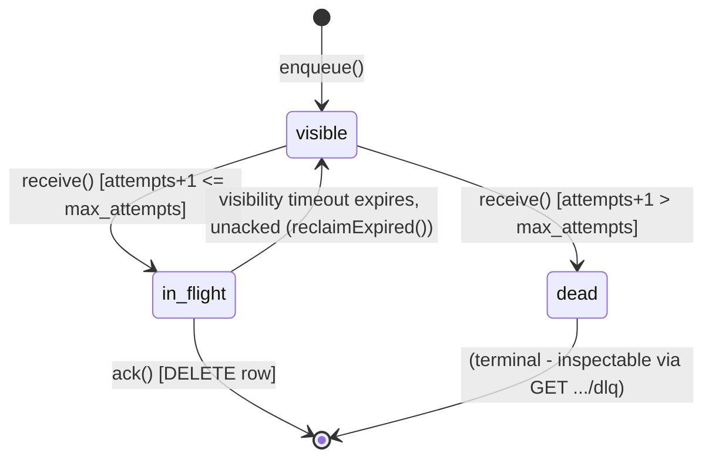
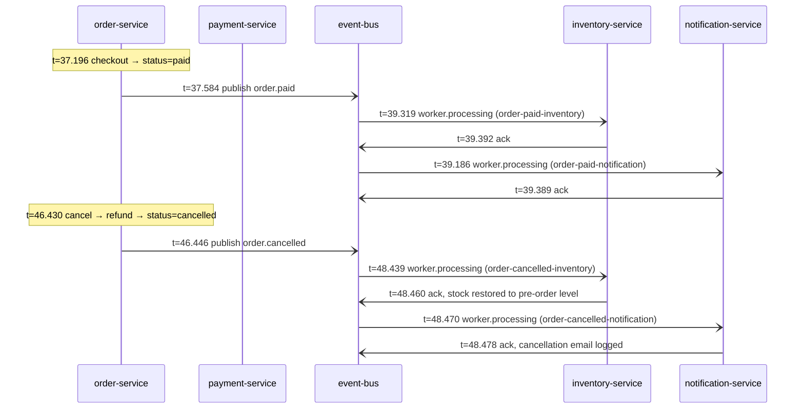

# Low-Level Design — E-Commerce Marketplace

Companion to [HLD.md](./HLD.md) (why this shape) and [REQUIREMENTS.md](./REQUIREMENTS.md) (what).
This document is the "how, precisely" view: schemas, API contracts, middleware ordering, and internal
algorithms, service by service. Everything here reflects the actual code, not a target design.

## 1. Conventions shared by every service

**Folder structure** (identical across all 9 backend services):
```
src/
  app.js            # Express app assembly, middleware order, route mounting
  server.js          # HTTP listen + (worker.js start, for inventory/notification)
  config/
    index.js         # env var parsing with dev fallbacks, prod-required checks
    logger.js         # structured JSON logger + correlation-id context (§3)
    db.js             # Mongoose connect (skipped in event-bus, which has no DB)
  middleware/
    correlationId.js  # first middleware in every app.js (§3)
    auth.js            # JWT verify (skipped in event-bus)
    authorize.js        # role check (skipped in event-bus, auth-service)
    rateLimit.js
    validate.js          # express-validator error → AppError.badRequest
    errorHandler.js       # notFoundHandler + uniform error JSON shape
  models/             # Mongoose schemas
  services/           # business logic + outbound HTTP clients to other services
  controllers/        # thin: call service, map result to status code
  routes/
```

**Middleware order** (every `app.js`, gateway included):
```
correlationId → helmet → cors → [express.json / cookie-parser where needed]
  → morgan → rateLimit → routes → notFoundHandler → errorHandler
```
`correlationId` must be first — every other middleware's logging (including morgan) and every route
handler needs the `AsyncLocalStorage` context already established.

**Error shape** — every service throws `AppError` (`message`, `statusCode`, `code`, optional
`details`), caught uniformly:
```js
class AppError extends Error {
  static badRequest(msg, details) → 400 BAD_REQUEST
  static unauthorized(msg)         → 401 UNAUTHORIZED
  static forbidden(msg)            → 403 FORBIDDEN
  static notFound(msg)             → 404 NOT_FOUND
  static badGateway(msg)           → 502 BAD_GATEWAY   // downstream service unreachable/erroring
}
```
`errorHandler` serializes any of these (or an unexpected error, defaulted to 500 `INTERNAL_ERROR`) as
`{ error: { code, message, details? } }`.

**Ownership check pattern**, repeated verbatim across order/payment services for any resource lookup:
```js
const isOwner = resource.userId === user.id;
const isAdmin = user.roles.includes('admin');
if (!isOwner && !isAdmin) throw AppError.notFound(...);  // 404, not 403 - don't leak existence
```

## 2. Gateway

**Port 3000.** No database, no JWT verification (see HLD §7 — verification happens per-service).
Responsibilities: correlation-id origination, CORS, helmet, rate limiting, and path-preserving reverse
proxy.

| Mounted path | Target |
|---|---|
| `/api/v1/auth/*` | auth-service |
| `/api/v1/products/*`, `/api/v1/categories/*`, `/api/v1/uploads/*`, `/uploads/*` | catalog-service |
| `/api/v1/cart/*` | cart-service |
| `/api/v1/orders/*` | order-service |

`payment-service`, `event-bus`, `inventory-service`, `notification-service` have **no gateway route** —
internal-only, reached by service-to-service calls exclusively.

**`pathRewrite: (path, req) => req.originalUrl`** on every proxy: `app.use(prefix, ...)` strips the
mount prefix from `req.url` before `http-proxy-middleware` v3 ever sees it; this restores the full
original path so the downstream service receives the same route the client requested. (Real bug found
and fixed during the original build — noted here because it's non-obvious and easy to regress.)

Body parsing is deliberately **not** mounted at the gateway — a proxied request must forward the raw
byte stream to the downstream service, not a re-serialized parsed-then-restringified body.

## 3. Observability internals

### 3.1 Correlation IDs

`config/logger.js`, identical in all 9 services:
```js
const als = new AsyncLocalStorage();

function log(level, event, meta = {}) {
  const correlationId = als.getStore();
  console[level](JSON.stringify({ level, event, ts: new Date().toISOString(),
    ...(correlationId ? { correlationId } : {}), ...meta }));
}

module.exports = {
  info, warn, error,                              // as before, now correlation-tagged automatically
  runWithCorrelationId: (id, fn) => als.run(id, fn),
  getCorrelationId: () => als.getStore(),
  correlationHeaders: () => {                       // spreads to {} outside any context -
    const id = als.getStore();                       // never sends the literal string "undefined"
    return id ? { 'X-Correlation-Id': id } : {};
  },
};
```

`middleware/correlationId.js`, mounted first in every `app.js`:
```js
function correlationId(req, res, next) {
  const id = req.headers['x-correlation-id'] || randomUUID();
  req.correlationId = id;
  res.setHeader('X-Correlation-Id', id);
  logger.runWithCorrelationId(id, next);      // everything downstream of next() shares this context
}
```

**Propagation paths**:
- *Sync, service→service*: every outbound `fetch` spreads `...logger.correlationHeaders()` into its
  headers object (`cartClient`, `paymentClient`, `catalogClient`, `eventBusClient`, `queueClient`).
- *Async, across the queue*: `eventBusClient.publish` embeds `correlationId` **inside the message
  payload**, not just the request header — the header doesn't survive a message sitting in SQLite for
  an arbitrary amount of time, but the payload does. `inventory-service`/`notification-service` workers
  read `message.payload.correlationId` and call
  `logger.runWithCorrelationId(id, () => processMessage(...))` before invoking the handler, re-entering
  the original trace from possibly minutes earlier. Falls back to a fresh `randomUUID()` if a message
  predates this field.

### 3.2 Metrics

`prom-client`-based, identical `config/metrics.js` in all 9 services: a private `Registry`,
`collectDefaultMetrics` (free process-level metrics — CPU, RSS, event-loop lag, GC), plus three custom
instruments per service, all labeled `{method, route, status_code}`:

| Metric | Type | Satisfies |
|---|---|---|
| `http_requests_total` | Counter | NFR16 "request count" |
| `http_request_duration_seconds` | Histogram (buckets 0.01–3s) | NFR16 "latency" |
| `http_errors_total` | Counter, incremented when `status_code >= 400` | NFR16 "error rate" |

`middleware/metrics.js`, mounted immediately after `correlationId` (before helmet/cors/routes) in every
`app.js`:
```js
function metrics(req, res, next) {
  const start = process.hrtime.bigint();
  const route = normalizeRoute(req.path);   // captured now - see note below
  res.on('finish', () => {
    const labels = { method: req.method, route, status_code: res.statusCode };
    httpRequestDuration.observe(labels, Number(process.hrtime.bigint() - start) / 1e9);
    httpRequestsTotal.inc(labels);
    if (res.statusCode >= 400) httpErrorsTotal.inc(labels);
  });
  next();
}
```
`normalizeRoute` collapses id-shaped path segments (24-hex Mongo ObjectIds, 36-char UUIDs, plain
numbers) to `:id`, so `/products/<id-a>` and `/products/<id-b>` aggregate under one Prometheus label
instead of exploding into one time series per id.

**Bug found and fixed while building this**: the route label was originally read from `req.path`
*inside* the `res.on('finish')` callback. For a route nested under `app.use(prefix, router)` that
terminates the response directly (a normal `res.json(...)`, never calling `next()`), Express never
restores `req.url`'s mount-prefix-stripped state — that restoration only happens as part of the `next()`
chain unwinding. A **successful** `GET /api/v1/products/:id` therefore recorded as route `/:id` (prefix
silently dropped), while the identical-shaped **404** case — which propagates via `next(err)` up to the
top-level error handler, triggering the restore — correctly recorded the full `/api/v1/products/:id`.
Same logical endpoint, two different Prometheus labels, confirmed by direct comparison of
`http_requests_total` before/after. Fixed by capturing `normalizeRoute(req.path)` into a local variable
at middleware-entry time (before any nested router can touch `req.url`), not by re-reading `req.path`
lazily at finish time.

`GET /metrics` is mounted next to `/health` in every service (Prometheus text exposition format, not
gateway-proxied — scraped directly per service, same access pattern as `/health`).

## 4. ecom-auth-service (port 3001, DB `ecom_auth`)

**`User` schema**: `email` (unique, lowercase), `passwordHash` (bcrypt, 12 rounds), `roles: [String]`
(default `['user']`), `tokenVersion: Number` (default 0, bumped to invalidate every outstanding refresh
token at once — powers `logout-all`).

| Endpoint | Auth | Body | Notes |
|---|---|---|---|
| `POST /register` | rate-limited | `email, password (≥8 chars)` | 12-round bcrypt hash |
| `POST /login` | rate-limited | `email, password` | issues access(15m) + refresh(7d, httpOnly cookie) |
| `POST /refresh` | rate-limited, cookie | — | rotates access token; verified working through the gateway proxy specifically |
| `POST /logout` | — | — | clears refresh cookie |
| `POST /logout-all` | JWT | — | bumps `tokenVersion`, invalidating all outstanding refresh tokens |
| `GET /me` | JWT | — | `toPublicJSON()`: id, email, roles, createdAt — never `passwordHash` |

## 5. ecom-catalog-service (port 3002, DB `ecom_catalog`)

**`Product`**: `name`, `slug` (unique, SEO id), `description`, `priceCents`, `stock`, `category` (ref),
`images: [String]`, `sellerId` (nullable — multi-vendor placeholder, null = platform-owned),
`isActive`, `avgRating` (default 0, indexed — see §5.1), `reviewCount` (default 0). Text index on
`name` (weight 5) + `description` (weight 1) powers the `q` search param.

**`Category`**: `name`, `slug` (unique).

| Endpoint | Auth | Notes |
|---|---|---|
| `GET /products` | optional | `optionalAuthenticate` attaches `req.user` if a valid token is present, never fails the request — powers `includeInactive=true` for authenticated admins only. Query filters: `q`, `category`, `minPrice`, `maxPrice`, `minRating` |
| `GET /products/:id` | — | resolves either a Mongo id or a slug at the same route (`getByIdOrSlug`) |
| `POST /products` | admin | |
| `PATCH /products/:id` | admin | body-validated (previously accepted anything unvalidated — fixed during admin-UI build) |
| `DELETE /products/:id` | admin | |
| `GET /categories` | — | |
| `POST /categories` | admin | |

### 5.1 Reviews & ratings

**`Review`**: `productId` (ref, indexed), `userId`, `userEmail`, `rating` (1–5), `comment` (≤2000
chars). Unique compound index on `(productId, userId)` — one review per user per product.

| Endpoint | Auth | Notes |
|---|---|---|
| `GET /products/:id/reviews` | — | paginated, newest first |
| `POST /products/:id/reviews` | JWT | **upsert**, not create — `Review.findOneAndUpdate({productId, userId}, ..., {upsert:true})`; a repeat call from the same user updates their existing review in place rather than duplicating it |
| `DELETE /products/:id/reviews/:reviewId` | owner-or-admin | |

**Rating aggregation** (`reviewService.recalculateProductRating`): re-aggregates from the `Review`
collection (`$avg`, `$sum: 1` via a Mongo aggregation pipeline) and writes `Product.avgRating`/
`reviewCount` on every review write or delete, rather than incrementing/decrementing in place — an
upsert can *change* an existing rating, not just add one, so an incremental update would drift from the
true average over time. Cheap enough to re-aggregate on every write at this scale.

**Deliberate scope cut**: no purchase verification before allowing a review. Enforcing "only reviewers
who bought this product" would require a synchronous call out to order-service, and catalog-service
currently has zero outbound dependencies on other services (it's a leaf node in the topology — see HLD
§4). Adding that coupling for a review-gating check was judged not worth it at this stage; any
authenticated user can review any product once.

**Verified**: posting 5★ then 3★ from two different users → `avgRating: 4, reviewCount: 2`; the first
user re-posting 2★ updates their review in place (same `_id`) → `avgRating: 2.5, reviewCount: 2`
(count unchanged, confirming upsert not duplicate-insert); `GET /products?minRating=3` correctly
excludes a 2.5-rated product while `?minRating=2` includes it; an unauthenticated `POST` is rejected
(401); a non-owner `DELETE` is rejected (404); deleting a review re-aggregates down to the remaining
reviews (`avgRating: 3, reviewCount: 1` after removing the 2★, leaving only the 3★).

## 6. ecom-cart-service (port 3003, DB `ecom_cart`)

**`Cart`**: one document per `userId` (unique). `items: [{ productId, name, priceCents, quantity }]` —
`name`/`priceCents` are a **snapshot at add-to-cart time**, not a live reference; checkout uses this
snapshot rather than re-fetching, so a mid-cart price change doesn't silently alter the order total.

| Endpoint | Notes |
|---|---|
| `GET /cart` | |
| `POST /cart/items` | sync call to catalog-service (`getProduct`) validates the product is active/in-stock and snapshots current name/price |
| `PATCH /cart/items/:productId` | |
| `DELETE /cart/items/:productId` | |
| `DELETE /cart` | |

All routes require JWT; no admin routes in this service.

## 7. ecom-order-service (port 3004, DB `ecom_order`)

**`Order`**: `userId`, `userEmail` (denormalized at checkout — see HLD §6.3 for why),
`items: [{ productId, name, priceCents, quantity }]`, `totalCents`,
`status: pending|paid|failed|cancelled|shipped|delivered`, `shippingAddress`.

| Endpoint | Auth | Notes |
|---|---|---|
| `POST /orders` | JWT | checkout — see §7.1 |
| `GET /orders` | JWT | scoped to caller |
| `GET /orders/admin` | admin | **all** orders, optional `?status=`; registered before `/:id` — Express route order matters, `"admin"` would otherwise match as an id |
| `GET /orders/:id` | owner-or-admin | |
| `PATCH /orders/:id/status` | admin | any `ORDER_STATUSES` value |
| `POST /orders/:id/cancel` | owner-or-admin | see §7.2 |

### 7.1 Checkout orchestration (`orderService.checkout`)
```
1. cartClient.getCart(bearerToken)          — sync, 502 if cart-service unreachable
2. Order.create({ status: 'pending', userEmail: user.email, ... })
3. paymentClient.charge(bearerToken, { orderId, amountCents })   — sync, blocks
4. order.status = payment.status === 'succeeded' ? 'paid' : 'failed'
5a. if paid:   cartClient.clearCart(); eventBusClient.publish('order.paid', payload)
5b. if failed: (cart untouched);        eventBusClient.publish('order.failed', payload)
```

### 7.2 Cancellation (`orderService.cancelOrder`)
```
CANCELLABLE_STATUSES = ['paid']   // pending/failed never reserved stock or held a charge;
                                   // shipped/delivered needs a returns/RMA flow, not built

1. Ownership check (owner or admin) → 404 if neither
2. Status check → 400 "Cannot cancel an order with status \"<status>\""
3. paymentClient.refund(bearerToken, { orderId })   — sync, idempotent
4. order.status = 'cancelled'
5. eventBusClient.publish('order.cancelled', { ...order.userEmail, ... })
```
Publishing uses `order.userEmail`, captured at checkout time, specifically so step 5 still reaches the
right person when an admin (not the order owner) triggered the cancel.

## 8. event-bus (port 3005, no MongoDB — SQLite at `data/queue.db`)

Internal-only; every route gated by `verifyInternalSecret` (`X-Internal-Secret` header) except `/health`.

**SQLite schema** (`better-sqlite3`, WAL mode):
```sql
CREATE TABLE messages (
  id TEXT PRIMARY KEY,
  queue TEXT NOT NULL,
  payload TEXT NOT NULL,             -- JSON, includes correlationId (§3)
  status TEXT NOT NULL DEFAULT 'visible',  -- visible | in_flight | dead
  receipt_handle TEXT,
  visible_at INTEGER NOT NULL,       -- epoch ms; controls both initial delivery delay and visibility timeout
  attempts INTEGER NOT NULL DEFAULT 0,
  max_attempts INTEGER NOT NULL DEFAULT 5,
  created_at INTEGER NOT NULL
);
```

**State machine**:

`receive()` first calls `reclaimExpired()` (flips any `in_flight` row past its `visible_at` back to
`visible` — this **is** the redelivery mechanism, no separate retry code exists), then selects up to
`maxMessages` visible rows ordered by `created_at`, and for each: if the next attempt would exceed
`max_attempts` it's dead-lettered instead of delivered; otherwise it's flipped to `in_flight` with a
fresh `receipt_handle` and a new `visible_at = now + visibilityTimeoutMs`.

| Endpoint | Purpose |
|---|---|
| `POST /events/:eventName` | fan-out publish — looks up `EVENT_QUEUES[eventName]`, enqueues into every subscribed queue (mirrors one SNS topic → several SQS subscriptions) |
| `POST /queues/:queueName/messages` | direct SendMessage-equivalent, bypasses fan-out (ops/debug) |
| `POST /queues/:queueName/receive` | pull, `?maxMessages&visibilityTimeoutSeconds` |
| `DELETE /queues/:queueName/messages/:receiptHandle` | ack |
| `GET /queues/:queueName/dlq`, `GET /stats` | ops visibility |

**Current `EVENT_QUEUES` config**:
```json
{
  "order.paid":      ["order-paid-inventory", "order-paid-notification"],
  "order.failed":    ["order-failed-notification"],
  "order.cancelled": ["order-cancelled-inventory", "order-cancelled-notification"]
}
```

## 9. ecom-payment-service (port 3006, DB `ecom_payment`)

**`Payment`**: `orderId` (indexed), `userId`, `amountCents`, `status: succeeded|failed` (the **original
charge outcome** — never mutated by a later refund, preserving the audit trail), `gatewayRef`,
`failureReason`, `refundRef` (null until refunded), `refundedAt` (null until refunded).

| Endpoint | Notes |
|---|---|
| `POST /payments/charge` | idempotent on `orderId` — a retried call returns the first `Payment` doc rather than double-charging. `mockGateway.charge`: any `amountCents % 100 === 13` declines; everything else succeeds |
| `POST /payments/order/:orderId/refund` | idempotent (already-refunded → returns existing doc); only a `succeeded` payment is refundable → 400 otherwise; `mockGateway.refund` always succeeds (no decline path modeled) |
| `GET /payments/order/:orderId` | owner-or-admin |

No card data ever persisted — the mock gateway returns only an opaque `gatewayRef`/`refundRef`, same
principle a real Stripe/Razorpay integration would follow to keep PCI scope low.

## 10. ecom-inventory-service (port 3007, DB `ecom_inventory`) — queue consumer

**`InventoryRecord`**: `productId` (unique), `stock`. Seeded lazily on first sighting via a live
`catalogClient.getProductStock` lookup (best-effort — a catalog outage falls back to `0` rather than
blocking the consumer, since reconciliation is idempotent and correctable later via the admin endpoint).

**`worker.js`** polls two queues in parallel every `WORKER_POLL_INTERVAL_MS` (default 3s):
| Queue | Handler | Effect |
|---|---|---|
| `order-paid-inventory` | `reserveForOrder` | `stock = max(0, stock - qty)` per line item; going negative just logs `oversold`, doesn't block (payment already succeeded) |
| `order-cancelled-inventory` | `restoreForOrder` | `stock += qty` per line item |

Each message is processed inside `logger.runWithCorrelationId(message.payload.correlationId, ...)` —
see §3. On handler failure the message is simply not acked (see §8 state machine for what happens next).

`GET /inventory/:productId` (admin, JWT) — debug/audit read.

## 11. ecom-notification-service (port 3008, DB `ecom_notification`) — queue consumer

**`NotificationLog`**: `userId`, `orderId`, `type: order_confirmation|payment_failed|order_cancelled`,
`channel` (default `'email'`), `recipient`, `subject`. Audit trail only — `mailer.js` logs instead of
calling SES/SMTP.

**`worker.js`** polls three queues in parallel every 3s:
| Queue | Handler |
|---|---|
| `order-paid-notification` | `sendOrderConfirmation` |
| `order-failed-notification` | `sendPaymentFailed` |
| `order-cancelled-notification` | `sendOrderCancelled` |

Same per-message correlation-context wrapping as inventory-service (§3, §10).

`GET /notifications`, `GET /notifications/order/:orderId` (admin, JWT) — audit view.

## 12. ecom-web (frontend, port 3100) — brief

Next.js 16 App Router / TypeScript / Tailwind, talks only to the gateway. Session (`user` + access
token) lives in `localStorage`, read via `useSyncExternalStore` so SSR and first client render agree.
`authFetch()` centralizes bearer-token attachment and transparent one-shot `POST /auth/refresh` retry on
401. Checkout branches UI on `order.status` (not HTTP status, since `POST /orders` always returns `201`
regardless of payment outcome). Full route list and the two backend gaps found while building the admin
UI (missing `GET /orders/admin`, catalog's `isActive` filter hiding deactivated products from admins
too) are in ARCHITECTURE.md — not duplicated here since this file is about backend LLD.

## 13. Cross-service sequence: full trace example

The concrete, verified example from this session — `correlationId = live-demo-1785430338`, order
`6a6b815547a7536a83090b58` — end to end:


Every log line above shares the same `correlationId`, independently verified by grepping all 9
services' logs after the run.

## 14. Remaining roadmap — rationale

Referenced from HLD §11. Ranked by cost-to-value at the current stage, not by raw importance:

1. **Redis caching for hot catalog reads (NFR9)** — real perf work, but premature without load data;
   nothing in this system has been load-tested, so there's no evidence catalog reads are actually a
   bottleneck yet. Worth doing once there's a number to point at — and once it is, `http_request_duration_seconds`
   from §3.2 is exactly what would supply that evidence.
2. **Log aggregation** — structured JSON logs with correlation ids exist (§3.1) and metrics are now
   scraped-ready (§3.2), but nothing ships the logs themselves anywhere (ELK/Loki/CloudWatch). Deliberately
   not built as a local fake — log aggregation is inherently a deployment-time infra decision (which
   backend, whose budget) rather than something to simulate without Docker.
3. **Multi-vendor layer (FR12–14)** — largest single scope item by far (seller onboarding, per-seller
   catalog/order split, commission/payout), and was explicitly deferred to phase 2 in REQUIREMENTS.md
   from the start. Ranked below the smaller items specifically because it's multi-week work that
   shouldn't block cheaper wins.
4. **Secrets management + deployment pipeline (NFR6, NFR11, NFR18–20)** — Dockerfiles, ECS/Fargate,
   Secrets Manager, CI. Ranked last not because it's unimportant but because it's the one item that's
   genuinely blocked on a decision the assistant can't make unilaterally (target AWS account, domain,
   budget) rather than blocked on more design work.

**Resolved since the last revision of this section**: metrics (NFR16) — see §3.2.
